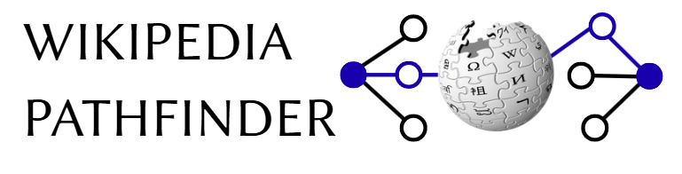

# Wiki Pathfinder

A website that finds the shortest path (or paths) between any two articles on Wikipedia! As a self-imposed restriction, this project does not utilize any APIs. Wikipedia Pathfinder is accurate as of June 2026.

## Documentation

  - [Data](docs/Data.md) - Information on how to source and process the data used
  - [Python Code](<docs/Core Logic.md>) - The design and thought process for the algorithms behind Wikipedia Pathfinder
  - [Local Hosting](<docs/Local Hosting.md>) - Instructions to run your own local instance of Wikipedia Pathfinder!

## Data

  - [SQL Cleaning](sql) - MYSQL code used to create and clean the initial MYSQL tables
  - [.bin File Creation](sql_to_bin)- code used to convert the MYSQL tables to the .bin files Wikipedia Pathfinder uses
  - [Data Files](https://drive.google.com/drive/folders/1zovQapluH6LGg_0V8Q7cpqaH-F0wSjCb?usp=drive_link) - Uploads of the cleaned SQL tables and .bin files

## Credits

  - [Wikipedia](https://www.wikipedia.org/) and the Wikipedia Speedrunning Community!
  - [Six Degrees of Wikipedia](https://www.sixdegreesofwikipedia.com/) for helping immensely with the initial research into building the project
